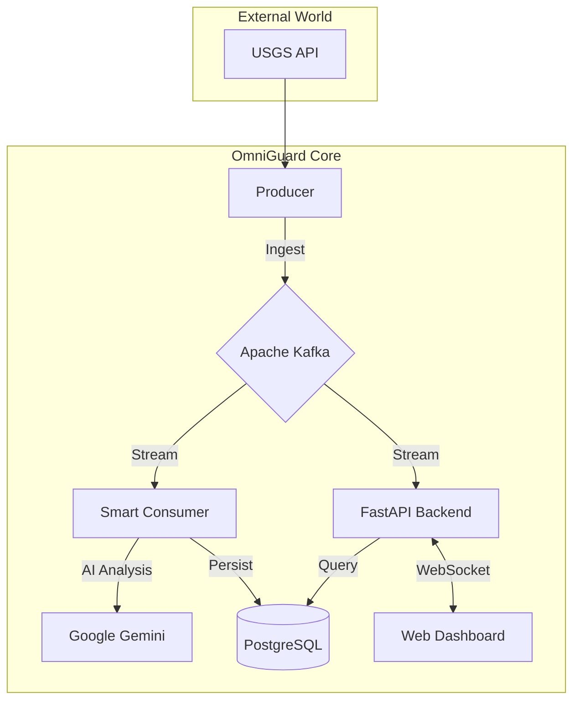

# OmniGuard: Intelligent Disaster Monitoring System

**OmniGuard** is a real-time, multi-source disaster monitoring platform designed to provide immediate situational awareness and automated safety guidance. It aggregates data from global seismic sources (such as USGS), processes it via an event-driven architecture, and visualizes critical information on an interactive dashboard.

---
## Phase One of the project currently Completeled , Phase 2 is currently ongoing with two more Api Sources , Higher throughput , Local Ai instead of online and a Data Lake for raw Data


## Key Features

* **Real-Time Ingestion:** Continuously monitors USGS earthquake data with 30-second polling intervals.
* **Proximity Filtering:** Automatically identifies events within a configurable radius of the user's location.
* **AI-Powered Guidance:** Leverages **Google Gemini AI** to provide instant, context-aware safety protocols for significant events.
* **AI Chat Assistant:** Interactive interface for follow-up inquiries and personalized emergency advice.
* **Interactive Dashboard:** Features a live Leaflet.js map with dynamic markers, radius visualization, and real-time event feeds via WebSockets.
* **Resilient Architecture:** Utilizes **Apache Kafka** to ensure data reliability and decoupling between ingestion and processing layers.
* **Data Persistence:** Records all event data in **PostgreSQL (PostGIS)** for historical analysis and reporting.

---

## System Architecture

OmniGuard utilizes a containerized microservices architecture to ensure scalability and reliability.


```mermaid
graph TD
    subgraph "External World"
        USGS[USGS API]
    end

    subgraph "OmniGuard Core"
        P[Producer] -->|Ingest| K{Apache Kafka}
        K -->|Stream| C[Smart Consumer]
        K -->|Stream| B[FastAPI Backend]
        
        C -->|AI Analysis| Gemini[Google Gemini]
        C -->|Persist| DB[(PostgreSQL)]
        
        B -->|Query| DB
        B <-->|WebSocket| UI[Web Dashboard]
    end
    
    USGS --> P

```

---

## Project Structure

```text
gradproj/
├── backend/            # FastAPI Backend & WebSocket Manager
│   └── main.py
├── frontend/           # Web Dashboard (HTML/CSS/JS)
│   ├── index.html
│   ├── style.css
│   └── app.js
├── consumer.py         # Smart Processing Service (AI & DB)
├── producer.py         # Data Ingestion Service (USGS)
├── docker-compose.yml  # Container Orchestration
├── view_db.py          # Database Inspection Utility
└── implementation_details.md # Technical Specifications

```

---

## Getting Started

### Prerequisites

* **Docker** and **Docker Compose** must be installed on the host machine.

### Installation and Deployment

1. **Clone the Repository:**
```bash
git clone https://github.com/RustyyES/omniguard.git
cd omniguard

```


2. **Configuration:**
Execute the setup script to configure environment variables and API credentials:
```bash
./setup.sh

```


3. **Launch System:**
Deploy the full stack using the following command:
```bash
docker compose up --build -d

```


4. **Access the Interface:**
Navigate to the following address in a web browser:
**[http://localhost:8000](https://www.google.com/search?q=http://localhost:8000)**

---

## Usage Guide

### 1. Dashboard Overview

* **Map Interface:** Visualizes the user's location and recent seismic events with categorized markers.
* **Live Feed:** Provides instantaneous updates as new data is processed.
* **Alert System:** High-priority events trigger an alert overlay containing AI-generated safety instructions.
* **AI Consultation:** The integrated chat allows users to request specific information, such as shelter locations or utility shut-off procedures.

### 2. Simulation Mode

To validate alert workflows without active seismic activity:

1. Access the **Simulator** panel on the sidebar.
2. Select **"Simulate Event Near Me"**.
3. The system will initiate a full alert cycle, including AI analysis and WebSocket notification.

### 3. Database Inspection

To query raw data stored within the system:

```bash
docker compose exec backend python view_db.py

```

---

## Technical Stack

* **Language:** Python 3.13
* **Backend Framework:** FastAPI
* **Message Broker:** Apache Kafka & Zookeeper
* **Database:** PostgreSQL 15 with PostGIS extension
* **Frontend:** HTML5, CSS3, JavaScript (ES6), Leaflet.js
* **Artificial Intelligence:** Google Gemini Generative AI
* **Orchestration:** Docker

---

## License

This project was developed for academic purposes as a Graduation Project.

---
