# 🌍 OmniGuard: Intelligent Disaster Monitoring System


**OmniGuard** is a real-time, multi-source disaster monitoring platform designed to provide immediate situational awareness and personalized safety guidance. It aggregates data from global sources (like USGS), processes it instantly using event-driven architecture, and visualizes it on an interactive dashboard.

---

## 🚀 Key Features

*   **⚡ Real-Time Ingestion:** Continuously polls USGS for earthquake data every 30 seconds.
*   **📍 "Near Me" Filtering:** Automatically detects events within a configurable radius of the user.
*   **🤖 AI-Powered Guidance:** Integrates with **Google Gemini AI** to provide instant, context-aware safety advice for significant events.
*   **💬 AI Chat Assistant:** Interactive chat interface to ask follow-up questions and get personalized safety advice during emergencies.
*   **🗺️ Interactive Dashboard:** Live Leaflet.js map with dynamic markers, radius visualization, and real-time event feeds via WebSockets.
*   **🛡️ Resilient Architecture:** Built on **Apache Kafka** to ensure data reliability and decoupling between ingestion and processing.
*   **💾 Historical Data:** Persists all events in **PostgreSQL (PostGIS)** for future analysis.

---

## 🛠️ System Architecture

OmniGuard uses a microservices-based architecture containerized with Docker.

```mermaid
graph TD
    subgraph "External World"
        USGS[📡 USGS API]
    end

    subgraph "OmniGuard Core"
        P[🔄 Producer] -->|Ingest| K{Apache Kafka}
        K -->|Stream| C[🧠 Smart Consumer]
        K -->|Stream| B[🚀 FastAPI Backend]
        
        C -->|AI Analysis| Gemini[✨ Google Gemini]
        C -->|Persist| DB[(🐘 PostgreSQL)]
        
        B -->|Query| DB
        B <-->|WebSocket| UI[💻 Web Dashboard]
    end
    
    USGS --> P
```



---

## 📦 Project Structure

```text
📂 gradproj/
├── 📂 backend/          # FastAPI Backend & WebSocket Manager
│   └── main.py
├── 📂 frontend/         # Web Dashboard (HTML/CSS/JS)
│   ├── index.html
│   ├── style.css
│   └── app.js
├── 📜 consumer.py       # Smart Processing Service (AI & DB)
├── 📜 producer.py       # Data Ingestion Service (USGS)
├── 📜 docker-compose.yml# Container Orchestration
├── 📜 view_db.py        # Utility to inspect database
└── 📜 implementation_details.md # Deep dive into technical specs
```

---

## 🏁 Getting Started

### Prerequisites
*   **Docker** and **Docker Compose** installed on your machine.

### Installation & Running

1.  **Clone the repository:**
    ```bash
    git clone https://github.com/RustyyES/omniguard.git
    cd omniguard
    ```

2.  **Configure the System:**
    Run the setup script to configure your API key and environment:
    ```bash
    ./setup.sh
    ```

3.  **Start the System:**
    Run the entire stack with a single command:
    ```bash
    docker compose up --build -d
    ```

3.  **Access the Dashboard:**
    Open your browser and navigate to:
    👉 **[http://localhost:8000](http://localhost:8000)**

---

## 🎮 Usage Guide

### 1. The Dashboard
*   **Map View:** Shows your location (blue circle) and recent earthquakes (red markers).
*   **Live Feed:** Updates instantly as new data arrives.
*   **Alerts:** If a dangerous event is detected near you, a red alert overlay will appear with AI-generated advice.
*   **AI Chat:** Use the chat interface in the alert overlay to ask specific questions like "Where is the nearest shelter?" or "How do I turn off gas?".

### 2. Simulation Mode
Want to test the alerts without waiting for a real earthquake?
1.  Go to the **Simulator** panel on the left.
2.  Click **"Simulate Event Near Me"**.
3.  Watch the system trigger a full alert workflow instantly!

### 3. Inspecting Data
To see the raw data stored in the database:
```bash
docker compose exec backend python view_db.py
```

---

## 🔧 Tech Stack

*   **Language:** Python 3.13
*   **Web Framework:** FastAPI
*   **Message Broker:** Apache Kafka & Zookeeper
*   **Database:** PostgreSQL 15 + PostGIS
*   **Frontend:** HTML5, CSS3, JavaScript (ES6), Leaflet.js
*   **AI:** Google Gemini Generative AI
*   **Containerization:** Docker

---

## 📝 License

This project is created for graduation project purposes.
