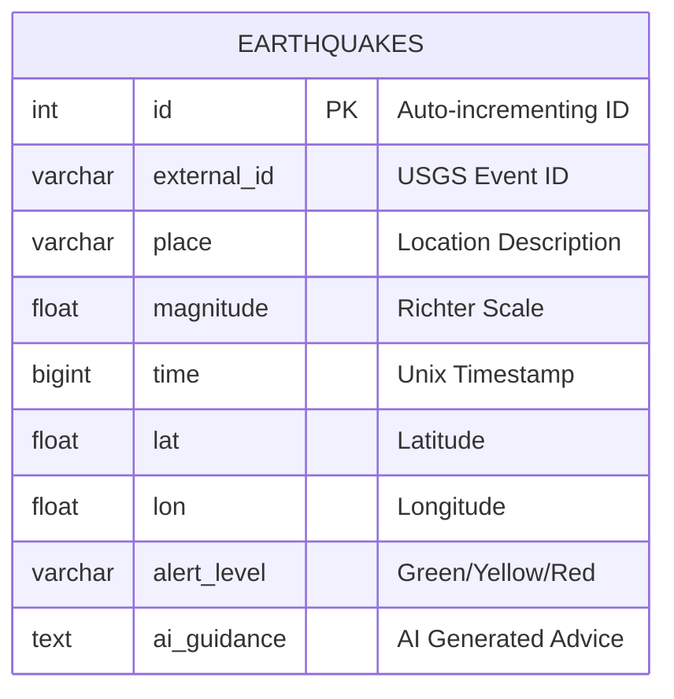

# OmniGuard Implementation Details

## 1. System Architecture

The OmniGuard system is built on a microservices-based event-driven architecture, containerized using Docker. It ensures real-time data ingestion, processing, and visualization.

```mermaid
graph TD
    subgraph "External Sources"
        USGS[USGS Earthquake API]
    end

    subgraph "Docker Network"
        Producer[Producer Service<br>(Python)]
        Kafka[Apache Kafka<br>(Message Broker)]
        Consumer[Consumer Service<br>(Python)]
        DB[(PostgreSQL + PostGIS)]
        Backend[Backend Service<br>(FastAPI)]
        
        USGS -->|Polls every 30s| Producer
        Producer -->|Publishes Events| Kafka
        Kafka -->|Consumes Events| Consumer
        Kafka -->|Consumes Events| Backend
        Consumer -->|Stores Data| DB
        Consumer -->|Generates AI Advice| Gemini[Google Gemini AI]
        Backend -->|Queries History| DB
    end

    subgraph "Frontend"
        Browser[Web Dashboard<br>(HTML/JS/Leaflet)]
        Browser <-->|WebSocket (Real-time)| Backend
        Browser <-->|REST API (History/Sim)| Backend
    end
```

## 2. Component Details

### A. Data Ingestion (Producer)
- **File:** `producer.py`
- **Function:** Polls the USGS Earthquake API every 30 seconds.
- **Key Logic:**
    - **Deduplication:** Maintains a `SEEN_EVENTS` set to avoid sending duplicate alerts for the same earthquake ID.
    - **Normalization:** Extracts key fields (Magnitude, Location, Time, Coordinates) and formats them into a standardized JSON event.
    - **Resilience:** Includes retry logic for the initial Kafka connection.

### B. Message Broker (Kafka)
- **Service:** `kafka` (and `zookeeper`)
- **Topic:** `disaster_events`
- **Role:** Decouples the ingestion layer from the processing and presentation layers. Allows multiple consumers (Storage Consumer, Real-time Dashboard) to process the same data stream independently.

### C. Smart Processing (Consumer)
- **File:** `consumer.py`
- **Function:** Listens to the `disaster_events` topic and processes alerts.
- **Key Logic:**
    - **"Near Me" Filtering:** Calculates the Haversine distance between the event and the user's configured location (`MY_LAT`, `MY_LON`).
    - **AI Integration:** If an event is significant (Mag > 5.0) or nearby, it calls the Google Gemini API to generate personalized safety advice.
    - **Persistence:** Stores the event details, calculated distance, alert level, and AI guidance into the PostgreSQL database.

### D. Database (PostgreSQL + PostGIS)
- **Service:** `db`
- **Schema:**
    - Table: `earthquakes`
    - Columns: `id`, `external_id`, `place`, `magnitude`, `time`, `lat`, `lon`, `alert_level`, `ai_guidance`.
- **Role:** Persists historical data for the "Recent Events" feed and analytical queries.

### E. Backend API (FastAPI)
- **File:** `backend/main.py`
- **Function:** Serves the frontend and provides API endpoints.
- **Key Features:**
    - **WebSocket Manager:** Manages active client connections and broadcasts real-time alerts received from Kafka.
    - **Background Thread:** Runs a dedicated thread to consume from Kafka without blocking the main async event loop (resolving startup hangs).
    - **Static Files:** Serves the `frontend/` directory.
    - **Simulation:** Endpoint to inject fake events into the Kafka stream for testing.

### F. Frontend Dashboard
- **Files:** `index.html`, `style.css`, `app.js`
- **Tech:** Vanilla HTML/JS, Leaflet.js for maps.
- **Features:**
    - **Live Map:** Visualizes user location (blue radius) and earthquake events (markers).
    - **Real-time Feed:** Updates instantly via WebSockets when new events occur.
    - **Alert Overlay:** Displays critical warnings and AI-generated advice.

## 3. Database Schema Visualization

Since we are using PostgreSQL, here is the Entity-Relationship (ER) diagram for our current data model:



## 4. Data Flow Summary
1.  **Ingest:** Producer fetches JSON from USGS -> Pushes to Kafka.
2.  **Process:** Consumer reads Kafka -> Checks Distance -> Calls AI -> Saves to DB.
3.  **Stream:** Backend reads Kafka -> Broadcasts to WebSocket -> Frontend displays Alert.
4.  **History:** Frontend requests API -> Backend queries DB -> Frontend displays List.
